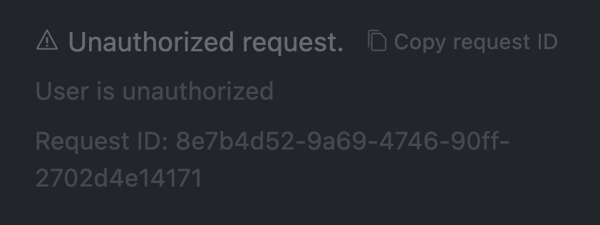

### cursor无限续杯文档（mac版本）

主要的原理就是使用新的账号有**14天**的免费使用期，不停的使用新的账号续杯。

::: tip
遇到的问题
- 1. 版本升级--使用指定的版本

- 2. 软件指纹的更新--使用软件更新软件指纹

- 3. 临时账号--临时注册邮箱，注册新的cursor账号

如果花费自己太多的时间和精力，则不建议这样操作，太费神费事。在这样重复劳动的事上，尽可能的减少自己的时间和精力的花费。  
::: 


### 1. 使用指定的版本

1. 下载指定的版本

   [44的Mac 版本](https://downloader.cursor.sh/builds/250103fqxdt5u9z/mac/installer/universal)

### 2. 更新软件指纹（mac版本）

```
curl -fsSL https://raw.githubusercontent.com/isboyjc/cursor-reset/main/scripts/reset.sh | sh
```

### 3.  临时账号

使用临时邮箱，注册新的cursor账号

遇到的问题
1. cursor会封一些后缀的邮箱，如果出现以下的错误，重新换一个邮箱注册即可，网上有很多临时邮箱，可以用来接收cursor的验证码。

