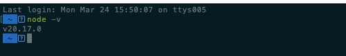
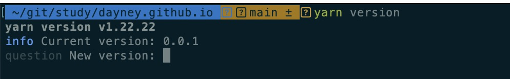
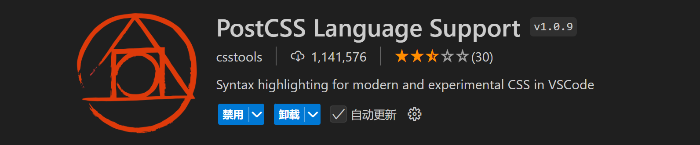
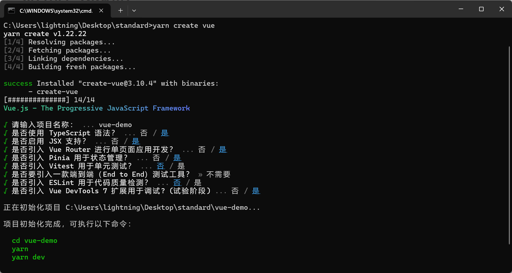
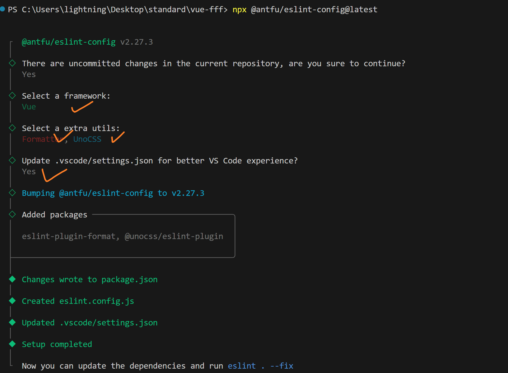

# 全新版本基础配置  less is more


> 由于vite脚手架要禁止*.cjs 和 eslint版本升级废弃rc配置文件， 故重新搭建。
>
> 核心采用antfu大神预设配置 替代prettier和eslint设置，保留stylelint原因是暂时antfu不支持。
>

## 1 前置条件

### node版本

> node 最好>20 因为eslint9的需要 本次项目node为20.15.1



### 包管理器

> 包管理器 暂时采用yarn(或者npm) 后续有机会换pnpm



### vscode 插件

> vscode 插件 eslint  prettier stylelint unocss  vue-official  postcss




### git 

> 安装官方git 用代码仓库管理


## 创建项目 

> 用官方命令创建项目 然后清空项目

```js
yarn create vue
```



## 1 styleLint 【采用】

> less和sass 推荐只选一个

### 依赖包 

>  "less": "^4.2.0", 
>
>   "postcss": "^8.4.41",
>
>   "postcss-html": "^1.7.0",
>
>   "postcss-less": "^6.0.0",
>
>   "postcss-scss": "^4.0.9",
>
>   "sass": "^1.77.8", 
>
>   "stylelint": "^16.8.2",
>
>   "stylelint-config-recess-order": "^5.1.0",
>
>   "stylelint-config-standard": "^36.0.1",

### 安装

```js
# 选择sass 可以选择不安装包含less相关 反之亦然
yarn add less sass postcss postcss-html postcss-less postcss-scss sass stylelint stylelint-config-recess-order stylelint-config-standard -D

#npm版本
npm install -D less sass postcss postcss-html postcss-less postcss-scss sass stylelint stylelint-config-recess-order stylelint-config-standard

# less
yarn add less postcss postcss-html postcss-less postcss-scss stylelint stylelint-config-recess-order stylelint-config-standard -D

# less npm
npm install -D less postcss postcss-html postcss-less postcss-scss stylelint stylelint-config-recess-order stylelint-config-standard


# sass yarn
yarn add sass postcss postcss-html postcss-scss sass stylelint stylelint-config-recess-order stylelint-config-standard -D

# sass npm
npm install -D sass postcss postcss-html postcss-scss sass stylelint stylelint-config-recess-order stylelint-config-standard
```


### 配置文件

- stylelint.config.mjs

  ```js
  /** @type {import('stylelint').Config} */
  export default {
    // stylelint-config-standard 基础配置
    // stylelint-config-recess-order 样式顺序
    extends: ['stylelint-config-standard', 'stylelint-config-recess-order'],
    // 不同文件类型用不同解析器 
    overrides: [
      {
        files: ['**/*.(css|html|vue)'],
        customSyntax: 'postcss-html',
      },
      // 选less可以注释scss 
      {
        files: ['*.less', '**/*.less'],
        customSyntax: 'postcss-less',
      },
      // 选sass可以注释上面的less
      {
        files: ['*.scss', '**/*.scss'],
        customSyntax: 'postcss-scss',
        rule: {
          'scss/percent-placeholder-pattern': null,
          'scss/at-mixin-pattern': null,
        },
      },
    ],
    rules: {
      // 'prettier/prettier': true,
      'media-feature-range-notation': null,
      'selector-not-notation': null,
      'import-notation': null,
      'function-no-unknown': null,
      'selector-class-pattern': null,
      'selector-pseudo-class-no-unknown': [
        true,
        {
          ignorePseudoClasses: ['global', 'deep'],
        },
      ],
      'selector-pseudo-element-no-unknown': [
        true,
        {
          ignorePseudoElements: ['v-deep',':deep'],
        },
      ],
      'at-rule-no-unknown': [
        true,
        {
          ignoreAtRules: [
            'tailwind',
            'apply',
            'variants',
            'responsive',
            'screen',
            'function',
            'if',
            'each',
            'include',
            'mixin',
            'extend',
            'use',
          ],
        },
      ],
      'no-empty-source': null,
      'named-grid-areas-no-invalid': null,
      'no-descending-specificity': null,
      'font-family-no-missing-generic-family-keyword': null,
      'rule-empty-line-before': [
        'always',
        {
          ignore: ['after-comment', 'first-nested'],
        },
      ],
      'unit-no-unknown': [true, { ignoreUnits: ['rpx'] }],
      'order/order': [
        [
          'dollar-variables',
          'custom-properties',
          'at-rules',
          'declarations',
          {
            type: 'at-rule',
            name: 'supports',
          },
          {
            type: 'at-rule',
            name: 'media',
          },
          'rules',
        ],
        { severity: 'error' },
      ],
    },
    ignoreFiles: ['**/*.js', '**/*.jsx', '**/*.tsx', '**/*.ts'],
  }
  
  ```

- package.json

  ```js
  {
    "scripts": {
       // ...
      "lint:stylelint": "stylelint  \"**/*.{css,scss,less,vue,html}\" --fix"
    }
  }
  ```

  

### 忽略文件 

- .stylelintignore

  ```js
  /dist/*
  /public/*
  ```

## 2 antfu 组合prettier&eslint 【采用】

> 配置网站 https://github.com/antfu/eslint-config/tree/feat/support-eslint-9?tab=readme-ov-file 
>
> 先选一个unocss 免得后续再去安装unocss的@unocss/eslint-plugin

### 命令行界面 (CLI) 安装

> 空格选择 回车下一步

```js
npx @antfu/eslint-config@latest
```



### 依赖包

>  "@antfu/eslint-config": "^2.27.3",
>
>  "eslint": "^9.9.1",
>
>  "eslint-plugin-format": "^0.1.2",
>
>  "@unocss/eslint-plugin": "^0.62.3",
>
>  "@unocss/preset-rem-to-px": "^0.62.3",


### 配置文件

- 生成.vscode/setting.json 修改为

  ```js
  {
    "typescript.tsdk": "./node_modules/typescript/lib",
    // "npm.packageManager": "pnpm",
    // "editor.formatOnSave": true,
    "editor.tabSize": 2,
    "editor.defaultFormatter": "esbenp.prettier-vscode",
    // 保存文件缓慢时，可以考虑开启以下 3 行配置。
    "vue.server.maxOldSpaceSize": 4096,
    "vue.server.hybridMode": true,
    "typescript.tsserver.maxTsServerMemory": 4096,
    "files.eol": "\n",
    "editor.guides.bracketPairs": true,
    "editor.bracketPairColorization.enabled": true,
    "vue.inlayHints.missingProps": true,
    "vue.autoInsert.dotValue": true,
    "explorer.copyRelativePathSeparator": "/",
    "search.exclude": {
      "**/node_modules": true,
      "**/*.log": true,
      "**/*.log*": true,
      "**/bower_components": true,
      "**/dist": true,
      "**/elehukouben": true,
      "**/.git": true,
      "**/.gitignore": true,
      "**/.svn": true,
      "**/.DS_Store": true,
      "**/.idea": true,
      "**/.vscode": false,
      "**/yarn.lock": true,
      "**/tmp": true,
      "out": true,
      "dist": true,
      "node_modules": true,
      "CHANGELOG.md": true,
      "examples": true,
      "res": true,
      "screenshots": true,
      "yarn-error.log": true,
      "**/.yarn": true
    },
    "files.exclude": {
      "**/.cache": true,
      "**/.editorconfig": true,
      "**/.eslintcache": true,
      "**/bower_components": true,
      "**/.idea": true,
      "**/tmp": true,
      "**/.git": true,
      "**/.svn": true,
      "**/.hg": true,
      "**/CVS": true,
      "**/.DS_Store": true
    },
    "files.watcherExclude": {
      "**/.git/objects/**": true,
      "**/.git/subtree-cache/**": true,
      "**/.vscode/**": true,
      "**/node_modules/**": true,
      "**/tmp/**": true,
      "**/bower_components/**": true,
      "**/dist/**": true,
      "**/yarn.lock": true
    },
    "eslint.useFlatConfig": true,
    "stylelint.enable": true,
    "stylelint.validate": ["css", "less", "postcss", "scss", "vue", "sass"],
    "path-intellisense.mappings": {
      "@/": "${workspaceRoot}/src"
    },
    "i18n-ally.localesPaths": ["src/locales/lang"],
    "i18n-ally.keystyle": "nested",
    "i18n-ally.sortKeys": true,
    "i18n-ally.namespace": true,
    "i18n-ally.pathMatcher": "{locale}/{namespaces}.{ext}",
    "i18n-ally.enabledParsers": ["json"],
    "i18n-ally.sourceLanguage": "en",
    "i18n-ally.displayLanguage": "zh-CN",
    "i18n-ally.enabledFrameworks": ["vue", "react"],
    // Disable the default formatter, use eslint instead
    "prettier.enable": false,
    "editor.formatOnSave": false,
  
    // Auto fix
    "editor.codeActionsOnSave": {
      "source.fixAll.eslint": "explicit",
      "source.organizeImports": "never",
      "source.fixAll.stylelint": "explicit"
    },
  
    // Silent the stylistic rules in you IDE, but still auto fix them
    "eslint.rules.customizations": [
      { "rule": "style/*", "severity": "off", "fixable": true },
      { "rule": "format/*", "severity": "off", "fixable": true },
      { "rule": "*-indent", "severity": "off", "fixable": true },
      { "rule": "*-spacing", "severity": "off", "fixable": true },
      { "rule": "*-spaces", "severity": "off", "fixable": true },
      { "rule": "*-order", "severity": "off", "fixable": true },
      { "rule": "*-dangle", "severity": "off", "fixable": true },
      { "rule": "*-newline", "severity": "off", "fixable": true },
      { "rule": "*quotes", "severity": "off", "fixable": true },
      { "rule": "*semi", "severity": "error", "fixable": true }
    ],
    "css.validate": false,
    "less.validate": false,
    "scss.validate": false,
    // Enable eslint for all supported languages
    "eslint.validate": [
      "javascript",
      "javascriptreact",
      "typescript",
      "typescriptreact",
      "vue",
      "html",
      "markdown",
      "json",
      "jsonc",
      "yaml",
      "toml",
      "xml",
      "gql",
      "graphql",
      "astro",
      "css",
      "less",
      "scss",
      "pcss",
      "postcss"
    ]
  }
  
  ```

- 生成 eslint.config.js 修改为

  ```js
  import antfu from '@antfu/eslint-config'
  
  export default antfu({
    // 使用prettier 格式化css html 等
    formatters: true,
    // unocss 检测&格式化 暂时注释 等配置了unocss再开放为true
    // unocss: true,
    // vue的eslint配置
    vue: true,
    // 保存删除未引入的代码
    // isInEditor: false,
    // 9x版本 忽略文件这种配置方式 废弃掉eslintignore
    ignores: [
      '*.sh',
      'node_modules',
      '*.md',
      '*.woff',
      '*.ttf',
      '.idea',
      '/public',
      '/docs',
      '.husky',
      '.local',
      '/bin',
      'Dockerfile',
    ],
    rules: {
      'style/semi': ['error', 'always'],
    },
  })
  ```
  
- package.json

  ```js
  {
    "scripts": {
       // ...
      "lint": "eslint .",
      "lint:fix": "eslint . --fix"
    }
  }
  ```

  

## 4 代码提交检查

#### 可以使用 [git commit 规范](/frontend/engineering/git.html)
