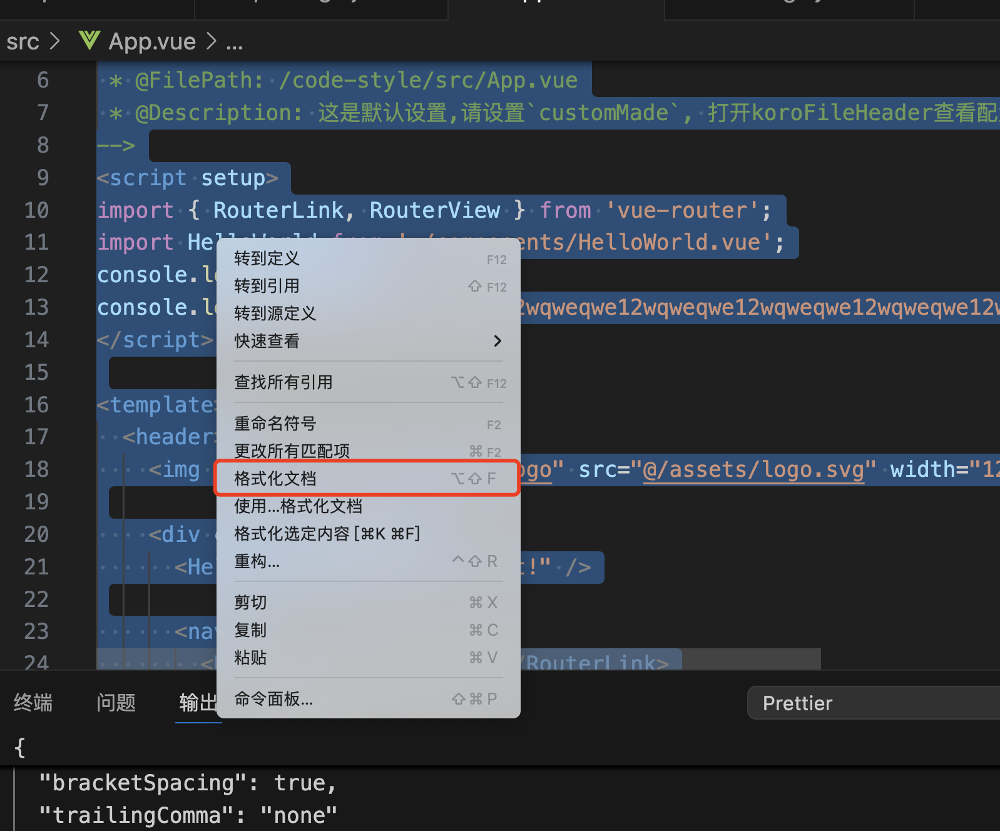

# .prettierrc
  方便团队的**code style**统一。


## 安装
安装的方式有很多，我采用**vs code**的插件方式来安装了使用

1.	打开 VSCode。
2.	确保已安装 Prettier 插件（“Prettier - Code formatter”）。
3.	在 VSCode 中，打开项目的根目录。
4.	打开命令面板（Ctrl + Shift + P），输入 Prettier: Create Configuration File。
5.	按下回车键，这将自动在项目根目录中生成 .prettierrc 文件。  


## 1. 代码格式化工具。

- 有两种模式，在项目代码中用来检测代码的规范，如使用命令`npm run format`, 如果需要使用`git hook`可以配合`husky`一起使用,会有更好的体验
  ```
  "format": "prettier --config ./.prettierrc --write ./*.* ./src/**/*.js ./src/**/*.ts ./src/**/*.css ./src/**/*.vue",
  ```

- 配合**VS Code**中的插件prettier,在编写代码的时候时时提示代码的风格

```
# .prettierrc


{
  "printWidth": 120,
  "singleQuote": true,
  "semi": true,
  "tabWidth": 2,
  "arrowParens": "avoid",
  "bracketSpacing": true,
  "trailingComma": "none"
}
```

## 2. 在项目中实践--检查配置是否生效

在**vscode**中安装**Prettier**插件，设置 **Prettier**是默认格式化工具，查看当前****Prettier****配置是否生效。

1. 选中项目中一个文件

2. 有件格式化当前文件
   

3. 查看是否按照 **.prettierrc**的方式来格式化文件的

## 2. 在项目中实践--设置自动格式化

在当前项目的**.vscode**目录下新建文件**settings.json**添加如下配置
```
# 文件路径是 .vscode/settings.json

{
  "editor.defaultFormatter": "esbenp.prettier-vscode",   // 设置 Prettier 为默认格式化工具
  "editor.formatOnSave": true                                         //  保存时自动格式化
}

```
每次修改好文件，保存文件的时候，就会自动按照当前配置好的**.prettierrc**的格式来格式化文件。


参考网站
prettier官网[https://prettier.io/docs/en/options.html](https://prettier.io/docs/en/options.html)
