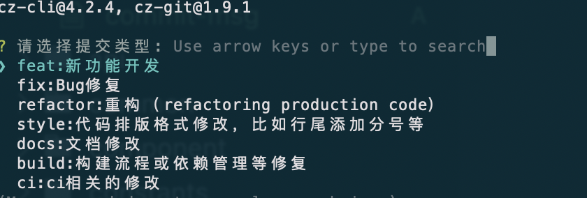
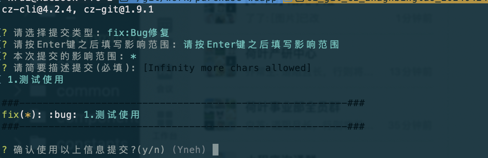
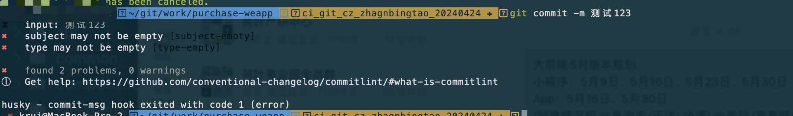
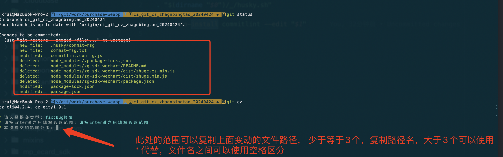
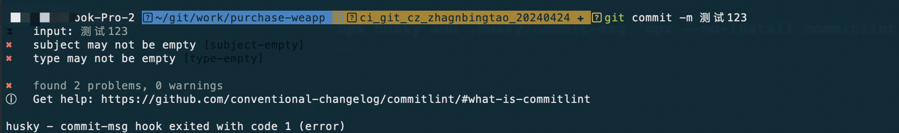
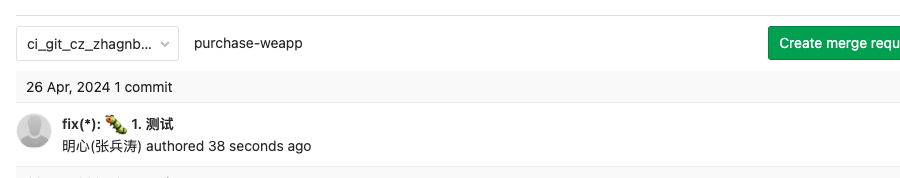

# Git提交规范--适配 node V14.x的版本

## 1. 效果演示






## 2. 主要插件

- commitizen: 代码提交辅助工具
- commitlint: 代码校验工具
- husky: githook 插件（有版本要求，是使用v8.x）
- git-cz： 自定义提交配置

## 3. 添加 git-cz 

#### 3.1 安装插件

```node
npm i -D  @commitlint/cli@^17 @commitlint/config-conventional@^17 husky@^8 cz-git
```

#### 3.2 配置插件

```
在项目的根目录下配置添加文件 commitlint.config.js 并写入如下代码

/** @type {import('cz-git').UserConfig} */
// eslint-disable-next-line no-undef
module.exports = {
  extends: ['@commitlint/config-conventional'],
  rules: {
    // @see: https://commitlint.js.org/#/reference-rules
    // 'header-max-length': [0, 'always', 72],
    // type 类型定义，表示 git 提交的 type 必须在以下类型范围内
    'type-enum': [
      2,
      'always',
      [
        'feat', // 新功能 feature
        'fix', // 修复 bug
        'docs', // 文档注释
        'style', // 代码格式(不影响代码运行的变动)
        'refactor', // 重构(既不增加新功能，也不是修复bug)
        'perf', // 性能优化
        'test', // 增加测试
        'chore', // 构建过程或辅助工具的变动
        'revert', // 回退
        'build', // 打包
        'ci', // 配置文件修改
        'init' // 初始化
      ]
    ]
  },
  prompt: {
    messages: {
      type: '请选择提交类型:',
      scope: '本次提交的影响范围 (可选):',
      customScope: '本次提交的影响范围:',
      subject: '请简要描述提交(必填):',
      body: '请输入详细变更 (可选). 使用 "|" 换行:\n',
      breaking: '本次提交列出破坏性改动 (可选). 使用 "|" 换行:\n',
      footerPrefixsSelect: '本次提交修复的issue (可选):',
      customFooterPrefixs: '请输入issue前缀:',
      footer: '本次提交修复的issue. 例如.: #31, #34:\n',
      confirmCommit: '确认使用以上信息提交?(y/n)'
    },
    types: [
      { value: 'feat', name: 'feat:     ✨  新功能', emoji: ':sparkles:' },
      { value: 'fix', name: 'fix:      🐛  修复问题', emoji: ':bug:' },
      { value: 'docs', name: 'docs:     📝  文档变更', emoji: ':memo:' },
      { value: 'style', name: 'style:    💄  代码格式/样式(不影响代码运行)', emoji: ':lipstick:' },
      {
        value: 'refactor',
        name: 'refactor: ♻️   重构(不含bug修复、没有功能新增)',
        emoji: ':recycle:'
      },
      { value: 'perf', name: 'perf:     ⚡️  性能优化', emoji: ':zap:' },
      {
        value: 'test',
        name: 'test:     ✅  增加测试',
        emoji: ':white_check_mark:'
      },
      {
        value: 'build',
        name: 'build:    📦️  构建打包',
        emoji: ':package:'
      },
      { value: 'ci', name: 'ci:       🎡  配置文件修改', emoji: ':ferris_wheel:' },
      { value: 'chore', name: 'chore:    🔨  构建过程或辅助工具的变动', emoji: ':hammer:' },
      { value: 'revert', name: 'revert:   ⏪️  回退、撤销', emoji: ':rewind:' },
      { value: 'init', name: 'init:     🎉  首次提交、初始化', emoji: ':tada:' }
    ],
    useEmoji: true,
    emojiAlign: 'center',
    themeColorCode: '',
    scopes: [],
    allowCustomScopes: true,
    allowEmptyScopes: true,
    customScopesAlign: 'bottom',
    customScopesAlias: 'custom',
    emptyScopesAlias: 'empty',
    upperCaseSubject: false,
    markBreakingChangeMode: false,
    allowBreakingChanges: ['feat', 'fix'],
    breaklineNumber: 100,
    breaklineChar: '|',
    skipQuestions: ['scope', 'customScope', 'body', 'breaking', 'footer', 'footerPrefix', 'customFooterPrefixs'],
    issuePrefixs: [{ value: 'closed', name: 'closed:   ISSUES has been processed' }],
    customIssuePrefixsAlign: 'top',
    emptyIssuePrefixsAlias: 'skip',
    customIssuePrefixsAlias: 'custom',
    allowCustomIssuePrefixs: true,
    allowEmptyIssuePrefixs: true,
    confirmColorize: true,
    maxHeaderLength: Infinity,
    maxSubjectLength: Infinity,
    minSubjectLength: 0,
    scopeOverrides: undefined,
    defaultBody: '',
    defaultIssues: '',
    defaultScope: '',
    defaultSubject: ''
  }
};
```

```
在package.json添加配置

"config": {
    "commitizen": {
      "path": "node_modules/cz-git"
    }
  }
```

```  
  在scripts中添加
  
  "prepare": "husky install"
```

#### 3.3 初始化 husky

```
npm run prepare
```

#### 3.4 在 husky中添加 commit-msg hook
```
npx husky add .husky/commit-msg 'npx --no-install commitlint --edit "$1"'
```

## 4. 如何使用

#### 4.1  在修改文件之后，正常使用 git add

#### 4.2  使用 git cz 代替 git commit



#### 4.3  正常使用 git push 提交代码

#### 4.4 错误演示



#### 4.5 gitlab上查看效果




## 参考文件

[git-cz](https://cz-git.qbb.sh/zh/guide/)

[husky v8](https://github.com/typicode/husky/releases/tag/v9.0.1)

[commitlint](https://commitlint.js.org/)
