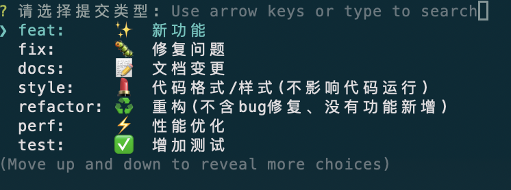
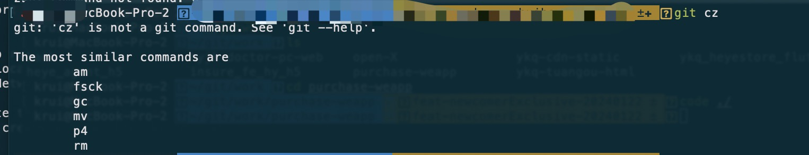
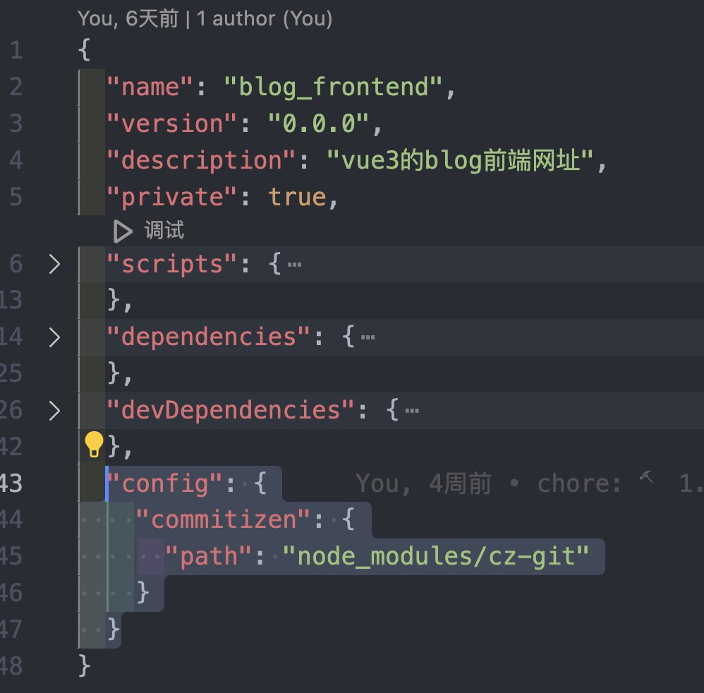

# Git提交规范

## 1 前言

在团队协作开发时，每个人提交代码时都会写 commit message。

每个人都有自己的书写风格，翻看我们组的git log, 可以说是五花八门，十分不利于阅读和维护。

一般来说，大厂都有一套的自己的提交规范，尤其是在一些大型开源项目中，commit message 都是十分一致的。

因此，我们需要制定统一标准，促使团队形成一致的代码提交风格，更好的提高工作效率，成为一名有追求的工程师，也方便后续统计commit的质量，另外在实际项目中有出现功能迁移的问题，希望每一个功能都是一个独立的commit（每一次的bug修复都有针对性），方便后续快速的迁移模块。

## 2. 效果展示 



## 3. 在项目中如何添加

#### 3.1 安装

- 需要在使用的时候全局安装 **commitizen**，不安装会出现如下提示

  

  安装命令
```
npm i -g commitizen
```

```javascript
npm i -D @commitlint/config-conventional commitizen cz-git
```

3.2 配置模版

```javascript
在项目的根目录下配置添加文件 commitlint.config.js 并写入如下代码

/** @type {import('cz-git').UserConfig} */
// eslint-disable-next-line no-undef
module.exports = {
  extends: ['@commitlint/config-conventional'],
  rules: {
    // @see: https://commitlint.js.org/#/reference-rules
    // 'header-max-length': [0, 'always', 72],
    // type 类型定义，表示 git 提交的 type 必须在以下类型范围内
    'type-enum': [
      2,
      'always',
      [
        'feat', // 新功能 feature
        'fix', // 修复 bug
        'docs', // 文档注释
        'style', // 代码格式(不影响代码运行的变动)
        'refactor', // 重构(既不增加新功能，也不是修复bug)
        'perf', // 性能优化
        'test', // 增加测试
        'chore', // 构建过程或辅助工具的变动
        'revert', // 回退
        'build', // 打包
        'ci', // 配置文件修改
        'init' // 初始化
      ]
    ]
  },
  prompt: {
    messages: {
      type: '请选择提交类型:',
      scope: '本次提交的影响范围 (可选):',
      customScope: '本次提交的影响范围:',
      subject: '请简要描述提交(必填):',
      body: '请输入详细变更 (可选). 使用 "|" 换行:\n',
      breaking: '本次提交列出破坏性改动 (可选). 使用 "|" 换行:\n',
      footerPrefixsSelect: '本次提交修复的issue (可选):',
      customFooterPrefixs: '请输入issue前缀:',
      footer: '本次提交修复的issue. 例如.: #31, #34:\n',
      confirmCommit: '确认使用以上信息提交?(y/n)'
    },
    types: [
      { value: 'feat', name: 'feat:     ✨  新功能', emoji: ':sparkles:' },
      { value: 'fix', name: 'fix:      🐛  修复问题', emoji: ':bug:' },
      { value: 'docs', name: 'docs:     📝  文档变更', emoji: ':memo:' },
      { value: 'style', name: 'style:    💄  代码格式/样式(不影响代码运行)', emoji: ':lipstick:' },
      {
        value: 'refactor',
        name: 'refactor: ♻️   重构(不含bug修复、没有功能新增)',
        emoji: ':recycle:'
      },
      { value: 'perf', name: 'perf:     ⚡️  性能优化', emoji: ':zap:' },
      {
        value: 'test',
        name: 'test:     ✅  增加测试',
        emoji: ':white_check_mark:'
      },
      {
        value: 'build',
        name: 'build:    📦️  构建打包',
        emoji: ':package:'
      },
      { value: 'ci', name: 'ci:       🎡  配置文件修改', emoji: ':ferris_wheel:' },
      { value: 'chore', name: 'chore:    🔨  构建过程或辅助工具的变动', emoji: ':hammer:' },
      { value: 'revert', name: 'revert:   ⏪️  回退、撤销', emoji: ':rewind:' },
      { value: 'init', name: 'init:     🎉  首次提交、初始化', emoji: ':tada:' }
    ],
    useEmoji: true,
    emojiAlign: 'center',
    themeColorCode: '',
    scopes: [],
    allowCustomScopes: true,
    allowEmptyScopes: true,
    customScopesAlign: 'bottom',
    customScopesAlias: 'custom',
    emptyScopesAlias: 'empty',
    upperCaseSubject: false,
    markBreakingChangeMode: false,
    allowBreakingChanges: ['feat', 'fix'],
    breaklineNumber: 100,
    breaklineChar: '|',
    skipQuestions: ['scope', 'customScope', 'body', 'breaking', 'footer', 'footerPrefix', 'customFooterPrefixs'],
    issuePrefixs: [{ value: 'closed', name: 'closed:   ISSUES has been processed' }],
    customIssuePrefixsAlign: 'top',
    emptyIssuePrefixsAlias: 'skip',
    customIssuePrefixsAlias: 'custom',
    allowCustomIssuePrefixs: true,
    allowEmptyIssuePrefixs: true,
    confirmColorize: true,
    maxHeaderLength: Infinity,
    maxSubjectLength: Infinity,
    minSubjectLength: 0,
    scopeOverrides: undefined,
    defaultBody: '',
    defaultIssues: '',
    defaultScope: '',
    defaultSubject: ''
  }
};
```

### 3.3 修改`packjson`文件

```
"config": {
    "commitizen": {
      "path": "node_modules/cz-git"
    }
  }
```


### 3.4 使用方式

在每次 `git add filename`之后使用 `git cz` 就会提示 commit的规范

### 3.5 commit的校验规则

```
// type 类型定义，表示 git 提交的 type 必须在以下类型范围内
'type-enum': [
  2,
  'always',
  [
    'feat', // 新功能 feature
    'fix', // 修复 bug
    'docs', // 文档注释
    'style', // 代码格式(不影响代码运行的变动)
    'refactor', // 重构(既不增加新功能，也不是修复bug)
    'perf', // 性能优化
    'test', // 增加测试
    'chore', // 构建过程或辅助工具的变动
    'revert', // 回退
    'build', // 打包
    'ci', // 配置文件修改
    'init' // 初始化
  ]
]
```

在每次 `git commit`的时候，会自动检测**commit**中的内容是否含有以上的关键词，如果没有则会提示
```
⧗   input: xxx
✖   subject may not be empty [subject-empty]
✖   type may not be empty [type-empty]

✖   found 2 problems, 0 warnings
ⓘ   Get help: https://github.com/conventional-changelog/commitlint/#what-is-commitlint

error Command failed with exit code 1.
info Visit https://yarnpkg.com/en/docs/cli/run for documentation about this command.
husky - commit-msg script failed (code 1)
```
需用使用者直接修改**commit**之后再提交，虽然可以人为的去在**commit**中使用以上关键词，但是不建议这样使用，为了保持大家格式统一，要求使用**git cz**代替**git commit**。


## 参考文件

[git-cz](https://cz-git.qbb.sh/zh/guide/)
