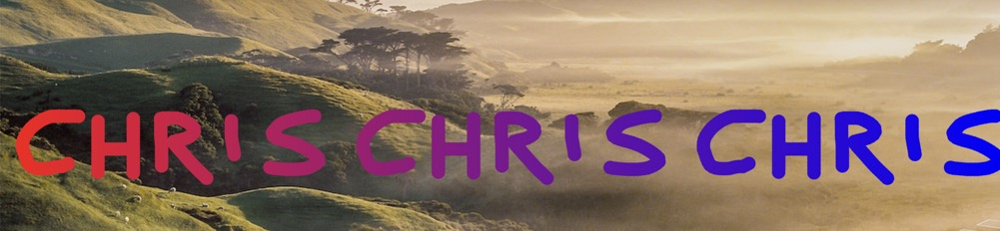

### CSS 属性 mask 允许使用者通过遮罩或者裁切特定区域的图片的方式来隐藏一个元素的部分或者全部可见区域。

主要是使用css来做一些简单的动画效果，如发光的logo，发光子，主要是配合**png**图片，做出像flash一样的遮罩动画一样的效果，用css主要的原因还是提升性能，研发和维护成本相对对外依赖少（前端人员+设计师出png图片，少了flash制作者）

#### 主要使用了如下3个属性
``` css
background-image: url(./demo);
background-size: cover;
background-position: center;
```

效果展示截图


参考文档

[mask-image](https://css-tricks.com/almanac/properties/m/mask-image/)

[mask](https://developer.mozilla.org/zh-CN/docs/Web/CSS/mask)
