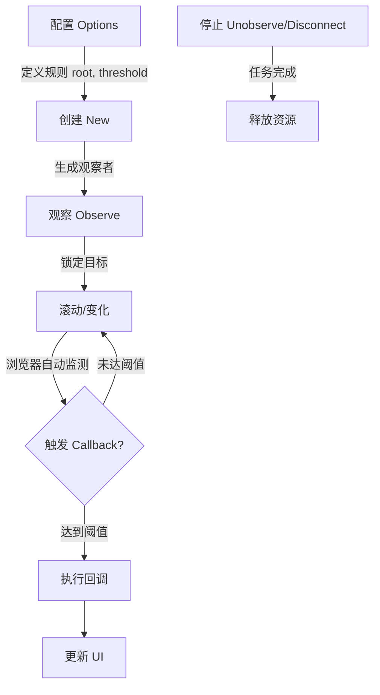

# Intersection Observer API 工作流程与使用指南

本文档总结了 Intersection Observer API 的完整执行流程，包括配置、触发机制、回调处理以及生命周期管理。

## 1. 核心概念与配置 (Configuration)

在使用 Intersection Observer 之前，首先需要定义**"在什么情况下触发通知"**。这是通过配置对象 `options` 来实现的。

```javascript
const options = {
  root: null,        // 视口元素 (默认是浏览器视口)
  rootMargin: '0px', // 视口的外边距 (用于扩大或缩小判定范围)
  threshold: 0       // 触发阈值 (0.0 - 1.0)
};
```

- **root**: 谁是容器？(默认为浏览器窗口)。
- **rootMargin**: 提前还是延后触发？(例如 `100px` 表示在元素进入视口前 100px 就触发)。
- **threshold**: 出现多少时触发？
  - `0`: 只要露头（或完全离开）就触发。
  - `0.5`: 出现一半时触发。
  - `1.0`: 完全进入视野时触发。
  - `[0, 0.5, 1]`: 在这三个时刻都会触发。

## 2. 初始化与绑定 (Initialization & Binding)

配置好后，需要创建一个观察器实例，并告诉它要观察哪个 DOM 元素。

```javascript
// 创建观察器实例
const observer = new IntersectionObserver(callback, options);

// 开始观察目标元素
const target = document.querySelector('#target');
observer.observe(target);
```

**执行流程：**

1. 浏览器创建 `observer` 实例。
2. `observer.observe(target)` 将目标元素加入观察列表。
3. **注意**：观察器创建后，会立即触发一次回调（即使目标不在视口中），用于报告目标的初始状态（`isIntersecting: false`）。

## 3. 触发机制 (Triggering)

浏览器会在后台持续监测目标元素与根元素（视口）的交叉状态。

**触发条件：** 当目标元素的可见比例 (`intersectionRatio`) 跨越了你设定的 阈值 (`threshold`) 时，回调函数会被放入任务队列。

- **进入时**：可见比例从 `< 阈值` 变为 `>= 阈值`。
- **离开时**：可见比例从 `>= 阈值` 变为 `< 阈值`。
- **异步特性**： Intersection Observer 是异步的，回调函数会在主线程空闲时执行，不会阻塞页面滚动。

## 4. 回调处理 (Callback Usage)

当触发条件满足时，浏览器执行定义的回调函数。

```javascript
const callback = (entries, observer) => {
  entries.forEach(entry => {
    if (entry.isIntersecting) {
      // 目标进入视口（或达到阈值）
      console.log('进入视口');
      // 常用操作：加载图片、播放视频、添加动画类名
    } else {
      // 目标离开视口
      console.log('离开视口');
    }
  });
};
```

- **entries**: 一个数组，包含所有状态发生变化的目标（通常是一个，但也可能有多个）。
- **entry.isIntersecting**: 最常用的属性，判断是“进”还是“出”。
- **entry.intersectionRatio**: 当前具体的可见比例。

## 5. 生命周期控制 (Lifecycle Methods)

你可以随时控制观察器的行为：

| 方法 | 描述 | 场景 |
| :--- | :--- | :--- |
| `observer.observe(el)` | 开始观察某个元素 | 初始化时，或动态添加新内容时。 |
| `observer.unobserve(el)` | 停止观察某个元素 | 图片加载完成后（不再需要观察）、元素被移除前。 |
| `observer.disconnect()` | 停止观察所有元素 | 页面卸载、组件销毁时，释放资源。 |
| `observer.takeRecords()` | 获取并清空挂起的记录 | 极少使用。用于在断开连接前，手动获取尚未处理的回调记录。 |

## 总结流程图



## 完整示例

```html [11.html]
<!DOCTYPE html>
<html lang="zh-CN">

<head>
  <meta charset="UTF-8" />
  <meta name="viewport" content="width=device-width, initial-scale=1.0" />
  <title>Intersection Observer API 全面演示</title>
  <style>
    body {
      font-family: 'Segoe UI', Tahoma, Geneva, Verdana, sans-serif;
      padding: 20px;
      display: flex;
      gap: 20px;
      height: 100vh;
      box-sizing: border-box;
      overflow: hidden;
      /* 防止 body 滚动，强制使用内部容器滚动 */
    }

    /* 左侧控制和日志区 */
    .sidebar {
      flex: 1;
      display: flex;
      flex-direction: column;
      gap: 10px;
      overflow-y: auto;
      padding-right: 10px;
      border-right: 1px solid #ccc;
    }

    .controls {
      background: #f0f0f0;
      padding: 15px;
      border-radius: 8px;
    }

    button {
      display: block;
      width: 100%;
      margin-bottom: 5px;
      padding: 8px;
      cursor: pointer;
      background-color: #007bff;
      color: white;
      border: none;
      border-radius: 4px;
    }

    button:hover {
      background-color: #0056b3;
    }

    button.danger {
      background-color: #dc3545;
    }

    button.danger:hover {
      background-color: #a71d2a;
    }

    #log {
      font-family: monospace;
      font-size: 12px;
      white-space: pre-wrap;
      background: #222;
      color: #0f0;
      padding: 10px;
      border-radius: 4px;
      flex: 1;
      overflow-y: auto;
    }

    /* 右侧演示区 */
    .demo-area {
      flex: 2;
      display: flex;
      flex-direction: column;
      align-items: center;
      justify-content: center;
    }

    /* 滚动容器 (root) */
    #scrollContainer {
      width: 400px;
      height: 400px;
      border: 4px solid #333;
      overflow-y: scroll;
      position: relative;
      background-color: #fff;
    }

    /* 占位空间，确保有滚动条 */
    .spacer {
      height: 600px;
      background: linear-gradient(to bottom, #eef, #ccf);
      display: flex;
      flex-direction: column;
      align-items: center;
      padding-top: 20px;
    }

    /* 目标元素 (target) */
    #target {
      width: 100px;
      height: 100px;
      background-color: #ff6b6b;
      margin-top: 400px;
      /* 放在中间位置 */
      margin-bottom: 400px;
      display: flex;
      align-items: center;
      justify-content: center;
      color: white;
      font-weight: bold;
      transition: background-color 0.3s;
    }

    #target.intersecting {
      background-color: #51cf66;
      /* 可见时变绿 */
    }

    /* 辅助线：Root Margin 可视化 (大致模拟) */
    .root-margin-visual {
      position: absolute;
      border: 2px dashed rgba(0, 0, 0, 0.2);
      pointer-events: none;
      top: 0;
      left: 0;
      right: 0;
      bottom: 0;
      display: flex;
      align-items: center;
      justify-content: center;
      color: rgba(0, 0, 0, 0.4);
      font-size: 12px;
    }
  </style>
</head>

<body>

  <div class="sidebar">
    <div class="controls">
      <h3>操作控制台</h3>
      <p>滚动右侧容器来触发回调。</p>
      <button onclick="startObserver()">1. 开始观察 (observe)</button>
      <button class="danger" onclick="stopObserver()">2. 停止观察 (unobserve)</button>
      <button class="danger" onclick="disconnectObserver()">3. 断开连接 (disconnect)</button>
      <button onclick="checkRecords()">4. 获取挂起记录 (takeRecords)</button>
      <hr>
      <p><strong>当前配置:</strong></p>
      <ul style="font-size: 12px; padding-left: 20px;">
        <li>root: #scrollContainer</li>
        <li>rootMargin: '-10% 0px -10% 0px' (收缩检测区域)</li>
        <li>threshold: [0, 0.5, 1.0]</li>
      </ul>
    </div>
    <div id="log">日志将显示在这里...</div>
  </div>

  <div class="demo-area">
    <h3>滚动容器 (Root)</h3>
    <div id="scrollContainer">
      <div class="root-margin-visual">Root Margin 区域 (上下各缩减 10%)</div>
      <div class="spacer">
        <p>向下滚动寻找目标...</p>
        <div id="target">Target</div>
        <p>继续向下滚动...</p>
      </div>
    </div>
  </div>

  <script>
    // 获取 DOM 元素
    const target = document.getElementById('target');
    const scrollContainer = document.getElementById('scrollContainer');
    const logArea = document.getElementById('log');

    let observer; // 保存观察器实例

    // --- 1. 配置选项 (IntersectionObserverInit) ---
    const options = {
      // root: 用作视口的元素。必须是目标的祖先。
      // 如果为 null，则默认为浏览器视口 (viewport)。
      root: scrollContainer,

      // rootMargin: 根元素的外边距。类似于 CSS margin。
      // 用于在计算交叉点之前扩大或缩小根元素的判定范围。
      // 这里设置为上下各缩小 10%，意味着目标必须进入容器内部 10% 的位置才算"可见"。
      rootMargin: '-10% 0px -10% 0px',

      // threshold: 阈值。规定了什么时候触发回调。
      // 可以是单个数字 (0.0 - 1.0) 或数字数组。
      // [0, 0.5, 1.0] 意味着：
      // 1. 刚刚出现 (0)
      // 2. 出现一半 (0.5)
      // 3. 完全出现 (1.0)
      // 这三个时刻都会触发回调。
      threshold: [0, 0.5, 1.0]
    };

    // --- 2. 回调函数 (IntersectionObserverCallback) ---
    // 当目标元素的可见性跨越了阈值时调用
    const callback = (entries, observer) => {
      entries.forEach(entry => {
        // entry 是 IntersectionObserverEntry 对象，包含所有核心信息

        const info = {
          time: Math.round(entry.time), // 时间戳
          isIntersecting: entry.isIntersecting, // 是否相交
          intersectionRatio: entry.intersectionRatio.toFixed(2), // 相交比例
          target: entry.target.id, // 目标元素

          // 矩形信息 (DOMRectReadOnly)
          boundingClientRect: formatRect(entry.boundingClientRect), // 目标尺寸
          rootBounds: formatRect(entry.rootBounds), // 根元素尺寸 (如果 root 为 null，视浏览器实现可能为 null)
          intersectionRect: formatRect(entry.intersectionRect) // 相交区域
        };

        // 视觉反馈：改变目标颜色
        if (entry.isIntersecting) {
          entry.target.classList.add('intersecting');
        } else {
          entry.target.classList.remove('intersecting');
        }

        log(`[Callback] 触发! 阈值跨越。\n${JSON.stringify(info, null, 2)}`);
      });
    };

    // 辅助函数：格式化矩形信息
    function formatRect(rect) {
      if (!rect) return 'null';
      return `Top: ${Math.round(rect.top)}, H: ${Math.round(rect.height)}`;
    }

    // --- 3. 方法演示 ---

    function startObserver() {
      if (observer) {
        log('观察器已存在，请勿重复创建。');
        return;
      }

      // 创建实例
      observer = new IntersectionObserver(callback, options);

      // observe(): 开始观察一个目标元素
      observer.observe(target);

      log('>>> 观察器已创建并开始观察 #target');
      log(`配置: root=${options.root.id}, rootMargin=${options.rootMargin}, threshold=${options.threshold}`);
    }

    function stopObserver() {
      if (!observer) return;

      // unobserve(): 停止观察特定目标
      observer.unobserve(target);
      log('>>> 已停止观察 #target (unobserve)');
    }

    function disconnectObserver() {
      if (!observer) return;

      // disconnect(): 停止观察所有目标
      observer.disconnect();
      observer = null; // 清理引用
      log('>>> 观察器已断开连接并销毁 (disconnect)');
    }

    function checkRecords() {
      if (!observer) {
        log('没有活跃的观察器。');
        return;
      }

      // takeRecords(): 返回所有观察目标的 IntersectionObserverEntry 对象数组，
      // 这些对象目前还在队列中等待被回调处理。
      // 调用此方法会清空队列，因此回调函数将不会收到这些记录。
      const records = observer.takeRecords();

      if (records.length > 0) {
        log(`>>> takeRecords() 获取到 ${records.length} 条挂起记录:`);
        records.forEach(entry => {
          log(` - Target: ${entry.target.id}, Ratio: ${entry.intersectionRatio}`);
        });
      } else {
        log('>>> takeRecords() 没有挂起的记录。');
      }
    }

    // --- 日志辅助 ---
    function log(message) {
      const div = document.createElement('div');
      div.textContent = `[${new Date().toLocaleTimeString()}] ${message}`;
      div.style.borderBottom = '1px solid #333';
      div.style.paddingBottom = '5px';
      div.style.marginBottom = '5px';
      logArea.prepend(div); // 最新日志在最上面
    }

    // 自动启动
    startObserver();

  </script>
</body>

</html>
```