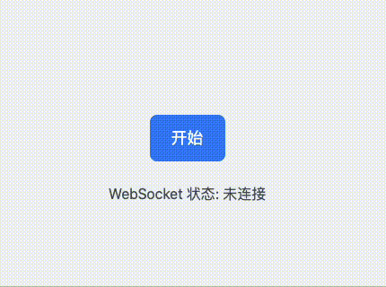

websocket心跳
========

WebSocketManager: 管理 WebSocket 连接、心跳检测、重连机制。


## 背景知识

主要是为了在录音同步转义的阶段，检测websocket连接是否正常，如果断开，则进行重连。首先是自动重连，自动重连采用3次（分别是3秒，5秒，8秒），同时页面上也显示正在重连的字样，在这3次重连都结束后，如果还是没有连接成功，则采用手动重连，手动重连也是触发自动重连，也需要显示当前是第几次重连。 


### 效果演示


### 原理讲解

在连接websocket的时候，如果连接通了，就开始发送数据（先发送与后端约定的首次请求的数据，再发送数据队列中的数据），同时启动心跳，心跳里面有检测心跳的逻辑，如果连接断开了，就自动重新连接，如果超过了自动重连设置的次数，就启动手动重连的策略。

小细节：
在最后一次自动连接的时候，页面上显示的是【正在第3次重连…】，真实的场景是要等第3次连接（无论成功还是失败）之后，才消失，然后再显示【手动连接】的按钮。所以其实此时终止连接，重置连接次数和所有的事件句柄，然后再显示【手动连接】的按钮。这个时候点击【手动连接】，才会从【正在第1次开始连接】开始计数。
部分片段代码如下：

```javascript
/**
 * 自动重连逻辑，最多尝试指定次数
 * @private
 */
private tryReconnect(): void {
  if (this.reconnectAttempts < this.maxReconnectAttempts) {
    const currentAttempt = this.reconnectAttempts + 1
    console.log(`【心跳】正在重连（第 ${currentAttempt} 次）`);
    this.callbacks.onReconnect?.(currentAttempt);

    const delay = this.reconnectDelays[this.reconnectAttempts];
    if (this.lastReconnectTimer) {
      clearTimeout(this.lastReconnectTimer)
    }
    this.lastReconnectTimer = setTimeout(() => {
      this.connect();
      this.reconnectAttempts++;
      if (this.reconnectAttempts === (this.maxReconnectAttempts + 1)) {
        this.reconnectEnd();
      }
    }, delay);
  } else {
    console.log('🔴 当前重连次数', this.reconnectAttempts);
    console.log('🔴 最大重连次数', this.maxReconnectAttempts);
    console.error('❌ 达到最大重连次数，显示手动重连按钮');
    this.reconnectEnd();
  }
}

/**
 * 重连结束
 */
private reconnectEnd():void {
  if (this.heartbeatTimer) clearInterval(this.heartbeatTimer);
  this.stopHeartbeat();
  this.resetReconnectAttempts();
  console.log('🔴 重连失败 end');
  this.callbacks.onReconnectEnd?.();
}
```

核心的心跳逻辑是采用事件轮训来检测 pong 的返回，主要是限定在一定的时间，如果检测不到pong，那么就认为自动断开，并触发重连。
```typescript
/**
 * 启动心跳检测，定时发送 ping 并检测 pong 超时
 * @private
 */
private startHeartbeat(): void {
  this.stopHeartbeat();
  this.heartbeatTimer = setInterval(() => {
    if (this.paused) return;
    this.idx++;
    const ping = JSON.stringify({ ping: { id: this.idx, ts: Date.now() } });
    console.log('【心跳】➡️ 发送心跳 ping');
    this.send(ping);
    this.pongTimeoutTimer = setTimeout(() => {
      console.error('【心跳】⏱️ 心跳超时，关闭连接');
      this.socket?.close();
    }, this.heartbeatInterval - 2000);
  }, this.heartbeatInterval);
}

// private connect(): void 方法中部分代码
// 连接关闭回调
this.socket.onclose = ():void => {
  console.warn('⚠️ WebSocket 已关闭');
  this.callbacks.onWebSocketClose?.();
  this.stopHeartbeat();
  // 非手动关闭时自动重连
  if (!this.manuallyClosed) {
    console.log('准备自动重连...');
    this.tryReconnect();
  }
};
```
### 项目示例地址
整个项目的demo地址是[webSocket-heartbeat](https://github.com/dayney/webSocket-heartbeat)
