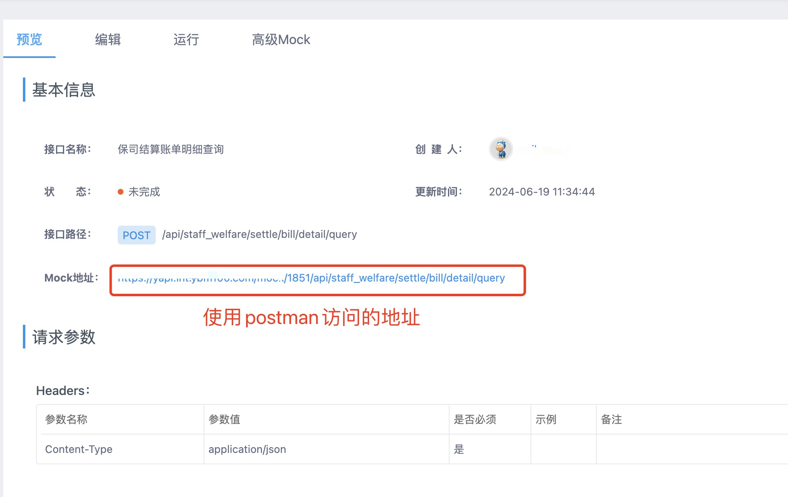
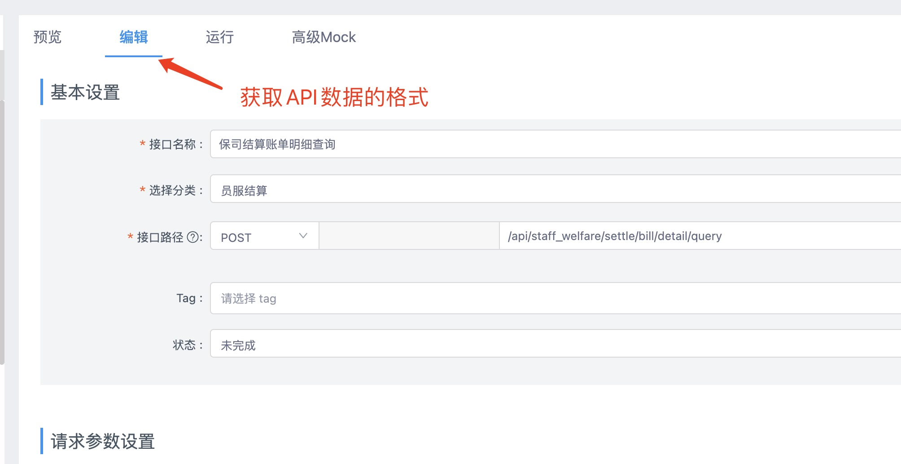
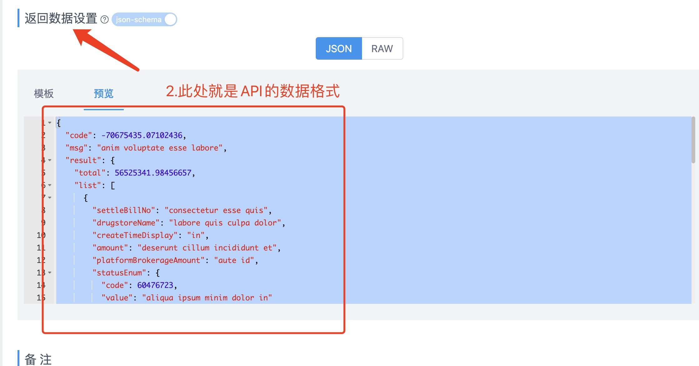
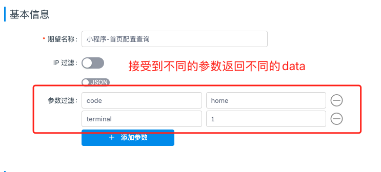
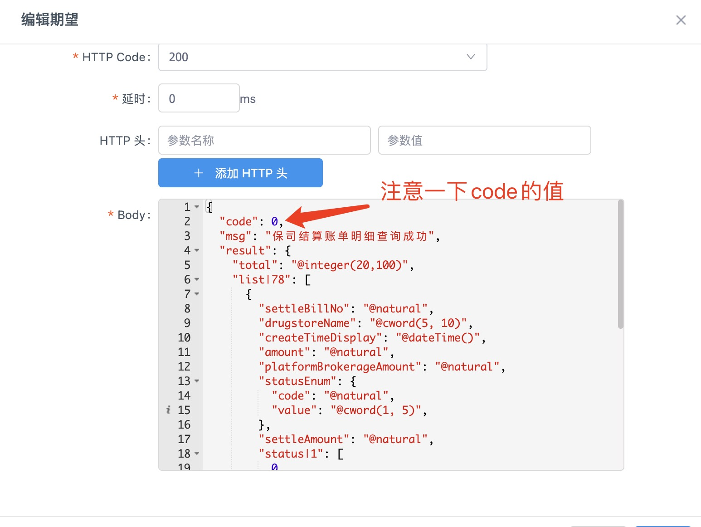
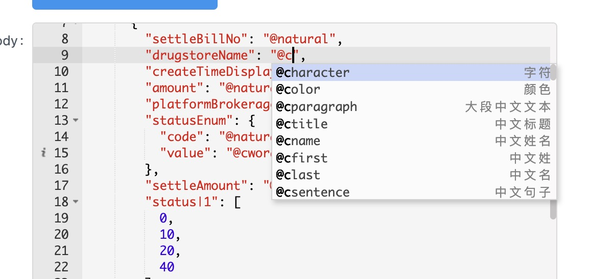

### YAPI中使用mockjs

---

### 背景

主要是解决了前后端并行开发的问题，在后端API设计出来之后，前后端评审之后，两端使用相同的数据格式来进行各自的开发。

### 解决的问题

- 前端：以约定的数据格式，进行前端的视图渲染，方便制作mockData，后续调试只需要切换接口地址就可以，减少联调时间；
- 后端：以约定的数据格式，进行入参数据测试，可以使用YAPI、postman等工具进行入参数据模拟，方便后续联调，只需要前端访问对应的API就可以正常联调，减少联调时间；

### 如何使用YAPI制作mockData

1. 打开YAPI应该可以看到如下的区域,界面中显示的【Mock地址】，就是我们后续使用的地址

2. 制作mockData
- 方式一

- 方式二

##### YAPI有自动的提示

参考文档

- [mockjs.com/examples](http://mockjs.com/examples.html)
- 随机数据参考了 [victorquinn/chancejs](https://chancejs.com/)