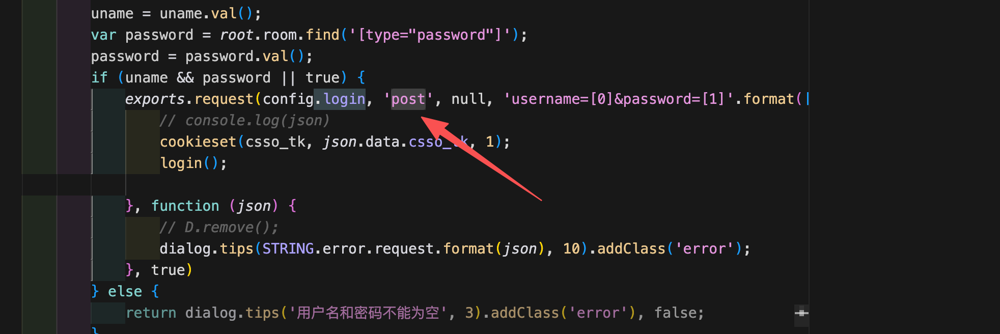
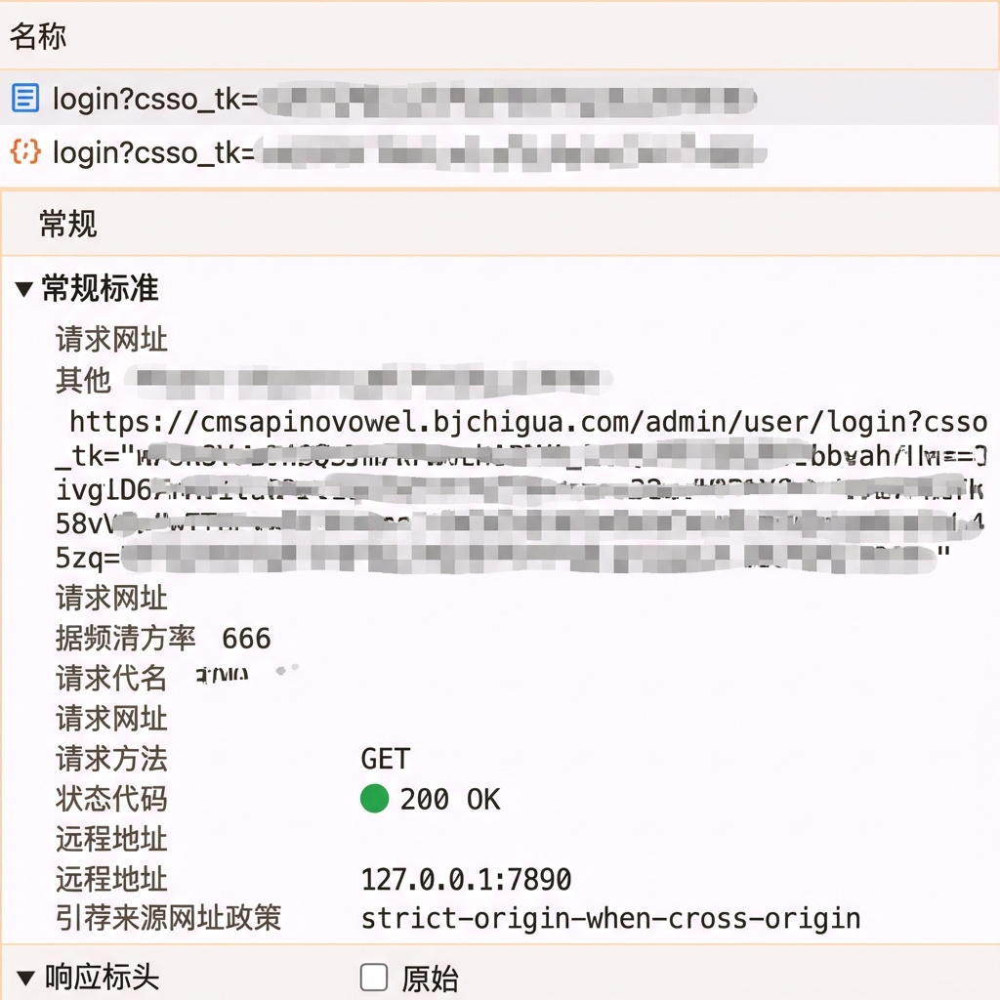
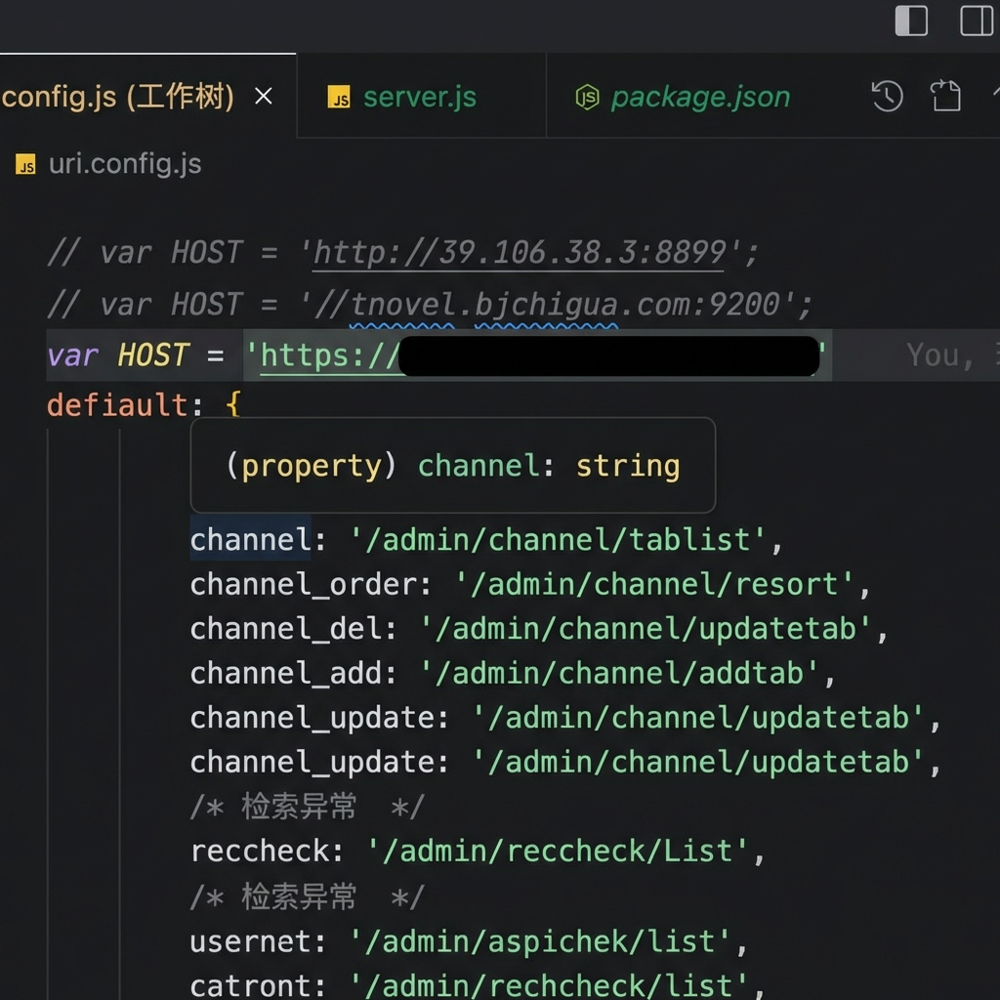

<!--
 * @Author: krui krui0728@gmail.com
 * @Date: 2025-09-16 10:56:41
 * @LastEditors: krui krui0728@gmail.com
 * @LastEditTime: 2026-01-12 13:38:58
 * @FilePath: /dayney.github.io/frontend/scene/redirct-url.md
 * @Description: 这是默认设置,请设置`customMade`, 打开koroFileHeader查看配置 进行设置: https://github.com/OBKoro1/koro1FileHeader/wiki/%E9%85%8D%E7%BD%AE
-->
# 登录失败深度解析：POST 请求为何变成了 GET？

## ⚠️ 一句话总结
我们在代码里写的是 `POST` 请求，但因为请求地址写的是 `http`，服务器为了安全返回了 **301/302 重定向** 要求跳转到 `https`。浏览器在处理这种重定向时，出于安全规范，会自动将 `POST` 请求降级为 **GET** 请求，并丢弃请求体（密码等数据），从而导致登录失败。

---

## 1. 案发现场：代码与现实的冲突

*   **前端代码**：明确指定使用 `post` 方法提交账号密码。
    

*   **浏览器抓包**：却发现发出去的是 `GET` 请求，且参数全部丢失。
    

---

## 2. 幕后黑手：HTTP 重定向 (301/302)

这**不是**浏览器的 Bug，而是 HTTP 协议定义的一种安全机制。

我们需要了解两个关键的 HTTP 状态码：
*   **301 (Moved Permanently)**: 永久重定向。表示“原本的地址已经作废，以后请直接去新地址”。
*   **302 (Found)**: 临时重定向。表示“原本的地址暂时不能用，请临时去新地址看看”。

**🔴 关键规则**
当浏览器发起非 GET 请求（如 `POST`）并收到 301 或 302 响应时，绝大多数浏览器（及其规范）会采取“安全优先”的策略：
1.  **改变方法**：将 `POST` 改为 `GET`。
2.  **丢弃数据**：丢弃原始请求体中的敏感数据（如密码），防止数据在跳转过程中被意外泄露或重复提交。

---

## 3. 还原真相：请求是如何“变异”的

**步骤深度解析：**
1.  **错误的起点**：我们在代码中配置了 `http://` 目标地址，导致浏览器向服务器的 **80端口 (HTTP)** 发起了 `POST` 请求（携带了账号密码）。
2.  **传达室的拦截**：服务器的 HTTP 服务虽然开启了，但它被配置为**“仅负责重定向，不处理业务”**。它看到你来访问 HTTP，直接拦截并返回 **301/302 状态码**，意思是：“我不办业务，请从这出门，去隔壁的 HTTPS (443端口) 大厅”。
3.  **浏览器的自我阉割 (关键)**：浏览器收到了“去新地址”的指令。但在跳转时，为了防止你的敏感数据（POST Body 中的账号密码）被发送到未知的第三方或泄露，浏览器触发了**安全保护机制**——**它不仅把 HTTP 改成了 HTTPS，还顺手把 POST 方法降级成了 GET 方法，并丢弃了所有 Body 数据**。
4.  **无辜的终点**：最终，请求到达了正确的 HTTPS (443端口) 服务，但此时它已经变成了一个**空空如也的 GET 请求**。服务器一脸懵圈：“你要登录？你的账号密码呢？”，只能报错。

---

## 4. 终极解决方案

既然问题出在“绕路”上，解决方案就是**不绕路**。

直接在配置文件中，将 API 地址的协议从 `//` (自动适配) 或 `http://` 改为明确的 **`https://`**。

这样前端直接向 HTTPS 地址发起 POST 请求，服务器直接接收，不再触发重定向，问题完美解决。

---

## 5. 扩展知识：如何保留 POST 状态？

如果确实需要重定向且必须保留 POST 方法（例如支付回调），服务器应该使用以下状态码：

*   **307 (Temporary Redirect)**: 类似 302，但强制要求浏览器**不改变**请求方法和 Body。
*   **308 (Permanent Redirect)**: 类似 301，但也强制**保持**原有的 POST 方法和 Body。

但在本案例中，直接配置正确的 HTTPS 地址才是最标准、最高效的做法。
